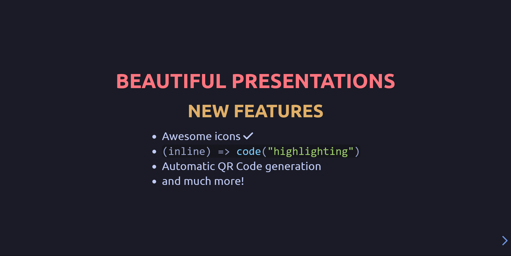

# RevealJS template

[Check it out!](https://ktkv419.github.io/revealjs-template/)
## Contents:
1. [Introduction](#introduction)
1. [Done](#done)
1. [Planned](#planned)
2. [Troubleshooting](#troubleshooting)

## Introduction
RevealJS is an awesome library that lets your create beautiful HTML, CSS, JavaScript presentations. They doesn't have lightweight boilerplate, therefore this project was created

## Done
- [Tokyo Night colorscheme](https://github.com/folke/tokyonight.nvim?tab=readme-ov-file) (+syntax highlighting)
- Inline code highlighting with [HighlightJS](https://github.com/highlightjs/highlight.js)
- [Awesome Icons](https://fontawesome.com)

Changes described here are presented in main branch, all experimentational features will be added in new releases

## Planned
- Interactivity mechanics
- PlantUML integration
- Automatic QR-code generation
- Realtime CSS editing through text field

## Troubleshooting
### HightlightJS doesnt pick up right language during highlighting
You need to manually set its language by adding `class="js"` to code tag. [List of supported languages](https://highlightjs.readthedocs.io/en/latest/supported-languages.html)
### Why awesome icons don't work?
You need to [create an account](https://fontawesome.com/start), add your host to allowed domains and change URL in head tag